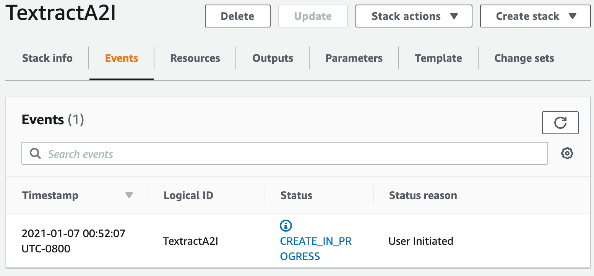
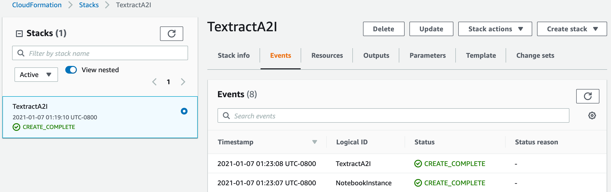

## Automate augmentation and processing of hand-written tabular data using Amazon Textract and Amazon A2I

This sample is based on the blog post (Link to be specified). It shows how you can use Amazon Textract Handwritten feature to extract tabular data from invoices and then have a human review loop using Amazon Augmented AI to make sure the predictions are highly accurate. Also it shows how to store the results into Amazon Dynamodb for making it available for downstream processing.

We walk you through the following steps using this Amazon SageMaker Jupyter notebook (Link to be updated):

1. Prerequisite step
2. Use Amazon Textract to retrieve tabular data from document  and Inspect and analyze line items from Amazon Textract response.
3. Set up  Amazon A2I human loop to review low confidence Amazon Textract response.
4. Store the augmented forms in Amazon Dynamodb for downstream processing

## Services Used
This solution uses AI services, and SageMaker.
* Amazon Textract– Uses ML to extract text and data from scanned documents in PDF, JPEG, or PNG formats. 
* Amazon A2I – to get human review of low confidence predictions or a random sample of predictions.
* Dynamo DB - Store the processed data to be used for downstream processing.

## This sample includes:

* README.md - this file

* textract-hand-written-a2i.ipynb - Jupyter Notebook containing details of how to use Amazon Textract to extract the content of your documents containing hand-written tabular data, setup and send to a human review loop, and augment the extracted invoice content for downstream processing.

* cfntextracta2i.yaml - this file contains the infrastrcutre code used by AWS CloudFormation to deploy notebook in your aws account.

## Deploy 1 click
Deploy a cloud formation template that will perform much of the initial setup work for you. In a another browser window or tab, login to your AWS account. Once you have done that, open the link below by clicking Launch Stack button in a new tab to start the process of deploying  the items you need via CloudFormatoin.

This CloudFormation template will complete the following:
1. Create a SageMaker Role for runnning blog post usecase
2. Create a SageMaker Notebook instance
3. Clone this repo codebase onto the Notebook instance.

Follow along with the screenshots below if you to deplpy the stack.

On this page you have a few tasks:

1. Change the Stack name to something relevant like `TextractA2I`
2. Update parameteres ensure the DefaultCodeRepo has vsalue of this repo `https://github/aws-samples/handwritten-docs-textract-augmented-ai.git`
3. Change the Notebook Name (Optional)
    - Alter the VolumeSize for the SageMaker EBS volume, default is 10GB, if your dataset is expected to be larger, please increase this accordingly.
4. Check the box to enable the template to create new IAM resources.
5. Click `Create Stack`.

For a few minutes CloudFormation will be creating the resources described above on your behalf it will look like this while it is provisioning:

Once it has completed you'll see green text like below indicating that the work has been completed:

Now that your environment has been created go to the service page for Sageamaker by clicking `Services` in the top of the console and then searching for `SageMaker` and clicking the service.

From the SageMaker console scroll until you see the green box indicating now many notebooks you have in service and click that.

On this page you will see a list of any SageMaker notebooks you have running, simply click the `Open Jupyter` link on the TextractA2INotebook notebook you have created

This will open the Jupyter environment, think of it as a web based data science IDE if you are not familiar with it. You should see `textract-hand-written-a2i.ipynb` notebook.

## Automate Augmentation using Notebook.
Open `textract-hand-written-a2i.ipynb` and follow along there.

## Security

See [CONTRIBUTING](CONTRIBUTING.md#security-issue-notifications) for more information.

## License

This library is licensed under the MIT-0 License. See the LICENSE file.

